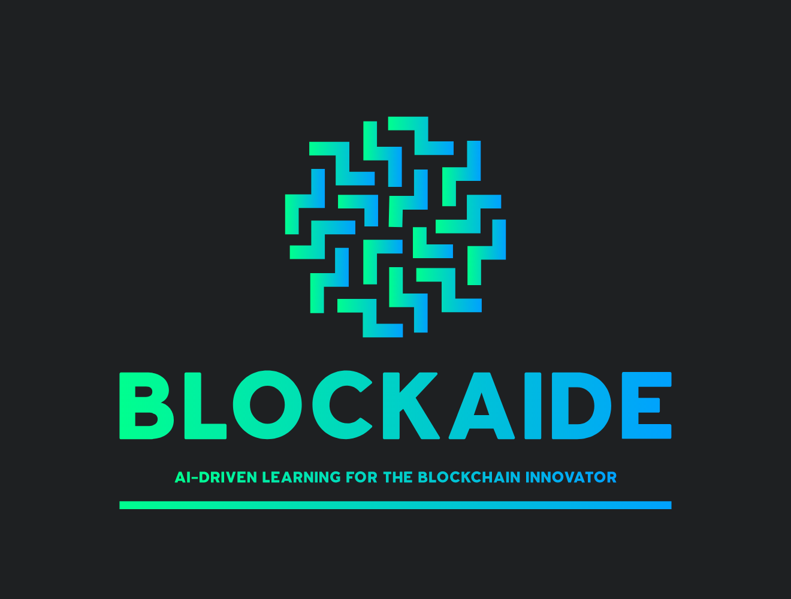

# AI Education System



## 🏆 Theta Hackathon 2024 Project

An AI-powered education platform that creates personalized learning experiences for blockchain and Web3 topics. The system leverages generative AI to tailor course content to each user's background, interests, and learning style.

## 📋 Overview

The AI Education System democratizes blockchain knowledge by providing adaptive, interactive learning experiences. The platform dynamically generates customized course content, explanations, illustrations, and quizzes based on user interaction.

### Key Features

- **Personalized Learning**: Content adapts to your background, interests, and learning style
- **AI Tutoring**: Conversational interface that guides learners through interactive courses
- **Course Generation**: AI creates customized course outlines for any blockchain topic
- **Visual Learning**: Integration with image generation for visual explanations
- **Interactive Quizzes**: Test your knowledge with AI-generated quizzes and receive instant feedback
- **Progress Tracking**: Monitor your learning journey with completion tracking
- **Web3 Integration**: Connect your wallet for a personalized experience

## 🛠️ Technology Stack

- **Frontend**: React.js with Material UI
- **Web3**: Wagmi, Ethers.js for blockchain integration
- **State Management**: React Context API and React Hooks
- **Authentication**: Web3 wallet-based authentication
- **Responsive Design**: Mobile and desktop friendly interface

## 🖼️ Screenshots

*(Add screenshots of the application here)*

## 🚀 Installation and Setup

### Prerequisites

- Node.js (v14 or higher)
- npm or yarn
- MetaMask or other Web3 wallet

### Installation

1. Clone the repository:
   ```bash
   git clone https://github.com/kennethPakChungNg/AI-Education-System-React-Frontend.git
   cd AI-Education-System-React-Frontend
   ```

2. Install dependencies:
   ```bash
   npm install
   # or
   yarn install
   ```

3. Configure environment variables:
   - Create a `.env` file based on `.env.example`
   - Set the API endpoint for the backend

4. Start the development server:
   ```bash
   npm start
   # or
   yarn start
   ```

5. Open [http://localhost:3000](http://localhost:3000) in your browser

## 📂 Project Structure

```
src/
├── assets/            # Images, icons, and fonts
├── components/        # Reusable UI components
│   ├── ChatWindow.js  # Chat interface component
│   ├── CourseOutlineDisplay.js  # Course outline display
│   ├── Message.js     # Individual message component
│   ├── NewCourseWindow.js  # Course generation interface
│   ├── Sidebar.js     # Application sidebar
│   ├── SuggestedCourse.js  # Suggested course view
│   └── UserProfile.js  # User profile management
├── contract/          # Smart contract integration
├── App.js             # Main application component
├── App.css            # Application styles
├── serverConfig.js    # Backend API configuration
└── walletConfig.js    # Web3 wallet configuration
```

## ⚙️ Core Components

### Interactive Learning Experience

The platform provides an interactive chat interface where users can communicate with an AI tutor. The AI responds conversationally and adapts its teaching style based on the user's profile and learning preferences.

### Dynamic Course Generation

Users can create custom learning paths by simply describing a topic they want to learn. The AI generates a structured course outline that can be modified and saved for continued learning.

### Visual Learning Support

The platform supports visual learning by generating relevant images to enhance understanding of complex blockchain concepts.

### Progress Tracking

The system tracks completed topics and provides a progress indicator to help users monitor their learning journey.

### Web3 Integration

Connect with MetaMask or other Web3 wallets to access personalized learning experiences and to save your progress on the blockchain.

## 🤝 Contributors

- [kennethPakChungNg](https://github.com/kennethPakChungNg) - Full Stack Developer
- [web3hugo1225](https://github.com/web3hugo1225) - Full Stack Developer

## 🏗️ Future Development

- Integration with blockchain-native identity and credentialing systems
- Expanded course catalog covering more blockchain and Web3 topics
- Enhanced AI tutoring capabilities through reinforcement learning
- Community-driven content and peer learning features
- Mobile application development

## 📄 License

This project is licensed under the MIT License - see the LICENSE file for details.

---

*This project was developed for the Theta Hackathon 2024, utilizing Theta EdgeCloud for decentralized computing.*
